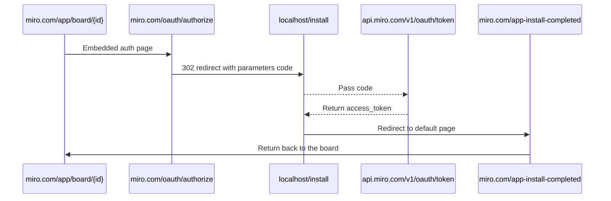
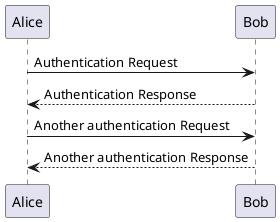

# About this App
This application leverages both the Miro Web SDK and REST API to demonstrate a Code > Diagram use case. More specifically, it is based on an open-source Plant UML library to draw UML diagrams from their textual description/code, and present it in Miro using our [V2 REST Connector endpoints](https://developers.miro.com/reference/create-connector). 

We've included this app in our example apps repo, specifically because of its use of our REST endpoints. To view the particular details of how the Miro REST API is called, see the supplementary READMME within, "Plant UML > Miro (V2 Connectors)" `README.md`, located at `miro-plantuml/src/main/kotlin/com/miro/miroappoauth/client/v2/README.md`.

## Stack
- [Open-source Plant UML library](http://plantuml.com)
- Backend: Kotlin
- Frontend: JavaScript/TypeScript
- [Miro REST API](https://developers.miro.com/reference/api-reference)
- [Miro Web SDK](https://developers.miro.com/docs/miro-web-sdk-introduction)

## Steps to run the application
- Register your application following [instruction](https://developers.miro.com/docs/getting-started)
  with default settings
- Once you have "Client ID", copy `application-local_template.yml` to `application-local.yml` and fill fields:
`clientId`, `clientSecret` and optional `teamId`.
- Run spring-boot application (see below instruction if you want to run it in IDEA)
```shell
mvn clean spring-boot:run -Dspring-boot.run.profiles=local
```
(or run "MiroAppOAuthApplication local" )
The service will start on http://localhost:3333
- For development purposes, start [ngrok](https://ngrok.com/product) to make your application available on HTTPS from the internet:
```shell
ngrok http --log stdout localhost:3333
```
or if you have paid subscription you can have fixed subdomain
```shell
ngrok http --subdomain my-test-miro-app --log stdout localhost:3333
```
Note, it's not required, you can also start locally HTTPS server (self-signed cert), see instruction below.
- Check the ngrok log, you'll see the ngrok domain in it (HTTPS address):
```
t=2021-06-07T12:52:44+0300 lvl=info msg="started tunnel" obj=tunnels name=command_line addr=http://localhost:3333 url=https://9744fbc871a8.ngrok.io
```
Pay attention, that now your local single port 3333 becomes public in the internet (while ngrok is working) 
without any IP or auth restriction.
* Open the link (e.g. https://9744fbc871a8.ngrok.io or https://localhost:3333/), and you'll see the app welcome page
* Copy "App URL" value to your app settings page
* Add "Redirect URI for OAuth2.0" value to your app settings page
* TODO set up Permissions
* Click "Authorize" button on the app welcome page and check the installation flow, check spring-boot application
logs and Browser Developer Tools to see exact URLs
* If your `teamId` parameter is set, you will have "Installation management URL" filled (e.g. to revoke the token)

## Run locally with self-signed certificate
Alternatively, you can run application on localhost with SSL port:
```shell
mvn clean spring-boot:run -Dspring-boot.run.profiles=ssl,local
```
To use HTTPS on localhost, you should enable this option in your Chrome browser
(“Allow invalid certificates for resources loaded from localhost.“):

chrome://flags/#allow-insecure-localhost

## Run in IDEA
Customize `MiroAppOAuthApplication` run configuration, you should execute Maven goal `generate-resources`
before starting spring-boot application. Also, please provide "Active profiles" value (usually it should be `local`).

## Application State page
To avoid confusion, please note, that "Session ID" and "User ID" on the "State" page are just values within your
browser session based on cookies (this way you can check different authorizations).

## Database console
By default, the server starts embedded H2 database (file-based: `miro-plantuml_h2.mv.db` in the local directory),
you can access database console at
http://localhost:3333/h2-console (https://localhost:3333/h2-console)
Pass JDBC URL: `jdbc:h2:file:./miro-plantuml_h2`, empty User Name and Password to Connect.

## Authorization flow


Sample PlantUML diagram

